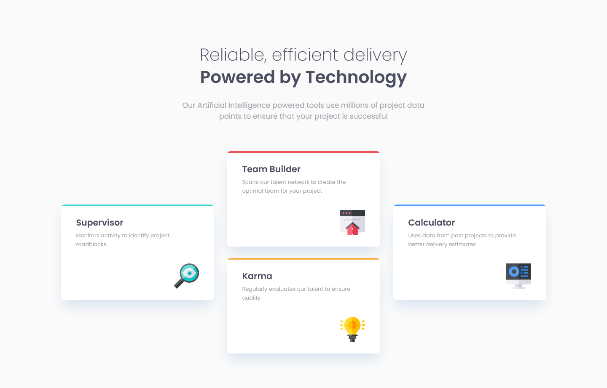
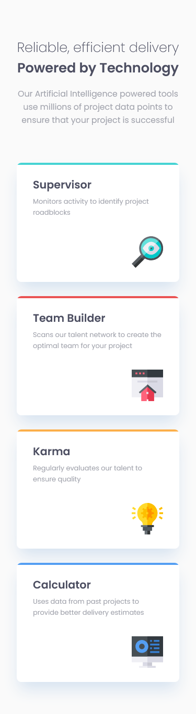

# Frontend Mentor - Four card feature section solution

This is a solution to the [Four card feature section challenge on Frontend Mentor](https://www.frontendmentor.io/challenges/four-card-feature-section-weK1eFYK). Frontend Mentor challenges help you improve your coding skills by building realistic projects.

## Table of contents

- [About myself](#about-myself)
- [Overview](#overview)
  - [The challenge](#the-challenge)
  - [Screenshot](#screenshot)
  - [Links](#links)
- [My process](#my-process)
  - [Built with](#built-with)
  - [What I learned](#what-i-learned)
  - [Continued development](#continued-development)
  - [Useful resources](#useful-resources)
- [Author](#author)
- [Acknowledgments](#acknowledgments)

## About myself

Hi! I'm Jordan, an aspiring frontend developer. This means that this project is probably not the best learning material. That being said, i'll try to explain my process to the best of my abilities (which is kinda limited considering the fact that english isn't my first language, by the way my apologies for any mispellings or grammatical errors) in case someone happen to read this file. Worst case scenario, i can always come back to this project later and have fun at how bad i was back then!

## Overview

### The challenge

Users should be able to:

- View the optimal layout for the site depending on their device's screen size

### Screenshot




### Links

- Solution URL: [Project on GitHub](https://github.com/joanFaseDev/four-card-feature-app)
- Live Site URL: [Project hosted through Vercel](https://four-card-feature-app.vercel.app/)

## My process

### Analysis

- This project is made out of a few elements:

  - A _main_ element to act as a global container.
  - A head title, a _h1_ element will do. Inside the _h1_, we'll need a span for some strings have a bigger font-weight.
  - A paragraph _p_, probably using the default font size.
  - Four cards

- Each card have a different content but their layout is the same:

  - We can use a _section_ element as a card container.
  - Each card have a title which is good because _section_ element need to have one. Here, a _h2_ would do.
  - Then a paragraph _p_ and a svg image/icon located in the bottom right corner. We can use an _img_ element here.
  - Between the _section_ and its content, we'll add a _div_ element with a width in percentage. That way, we won't have to _padding_ for the cards.
  - Each card have a border top of a different color. Border style seems to be _inset_.
  - Also, each card use a light _box shadow_ and _border-radius_.

- Because the card's layout is the same, we can reuse a lot of code by using appropriate classes.

- The global layout for the mobile design is simple enough, one column for five rows. As for the desktop design, it's probably three columns for five rows. We'll use CSS Grid for the global layout and maybe Flexbox for the layout's cards.

- As usual, we'll start with the mobile design for it is easier to add complexity to a design than to remove from it.

### Built with

- Semantic HTML5 markup
- CSS custom properties
- Flexbox
- CSS Grid

### What I learned

- This project gave me the opportunity to experiment with borders. The card's design here is particular, precisely the way the color border of each card is cut. Initially i couldn't replicate the angle as seen in the mockup but i ended up 'making the cut' (ahaha) by using the following recipe:

  Basically i designed each card as a _section_ element so i nested a _div_ between my sections and their sub-containers (i used them to replace padding by setting a max-width).

```html
<section class="card card--supervisor">
  <div class="card__hidden hidden--supervisor"></div>
  /* The famous div!*/
  <div class="card__container">
    <h2 class="card__title">Supervisor</h2>
    <p class="card__paragraph">
      Monitors activity to identify project roadblocks
    </p>
    <div class="icon__container">
      
    </div>
  </div>
</section>
```

Then i create a top border for the div then used the _overflow_ property of my sections to 'cut' the border in the appropriate way.

```css
.card {
  box-shadow: var(--box-shadow--card) 0px 18px 30px -5px;
  background-color: var(--background-color--card);
  border: none;
  border-radius: 0.6rem;
  padding: 0 0 1.8em;
  margin-bottom: 1.8em;
  overflow: hidden;
}

.card__hidden {
  height: 1.4em;
}

.hidden--supervisor {
  border-top: 4px solid var(--color-team-supervisor);
}
```

There's probably better ways to do it and i'll try to ask the Frontend Mentor's community about it but honestly i'm quite satisfied with the current result (one of the best thing about being a developer is that feeling of finding a solution by oneself).

### Continued development

- I'm gonna keep working on CSS fundamentals like position, length units, responsive design (i put it in the fundamentals because it's basically mandatory nowadays), flexbox and grid.
- I still have two level 1 project from Frontend Mentor with nothing but HTML and CSS. Then i'll add JavaScript to the lot. I'm impatient because i didn't use the language in 2 weeks and i don't want to lose what little i managed to learn (i put a short stop to JavaScript because i felt i needed to learn more about CSS before mixing the two).

## Author

- Frontend Mentor - [@joanFaseDev](https://www.frontendmentor.io/profile/joanFaseDev)
